# Fundamentos del desarrollo de videojuegos
### Diego Herrera Mendoza
Movimiento rectilineo

1. Crear un script que mueva el objeto hacia un punto fijo que se marque como objetivo utilizando el método Translate de la clase Transform. El objetivo debe ser una variable pública, de esta forma conseguimos manipularla en el inspector y ver el efecto de distintos valores en las coordenadas. Utilizar `this.transform.Translate(goal)` en el start, solo se mueve una vez Experimentar las siguientes opciones:

a. Añadir this.transform.Translate(goal); al Update e ir multiplicando goal = goal * 0.5f; en el start para dar saltos más pequeños cada vez.
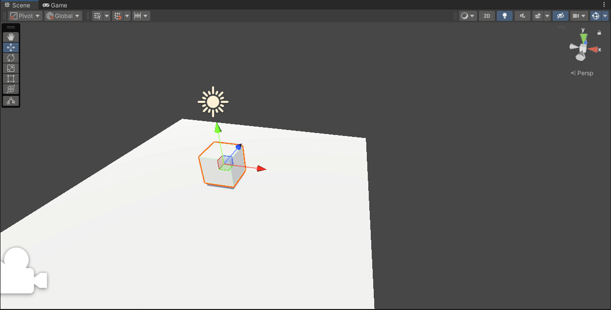
- Script: [Ejercicio1-a](scripts/Ejercicio1-a.cs)

b. Configurar la coordenada Y del Objetivo en 0.
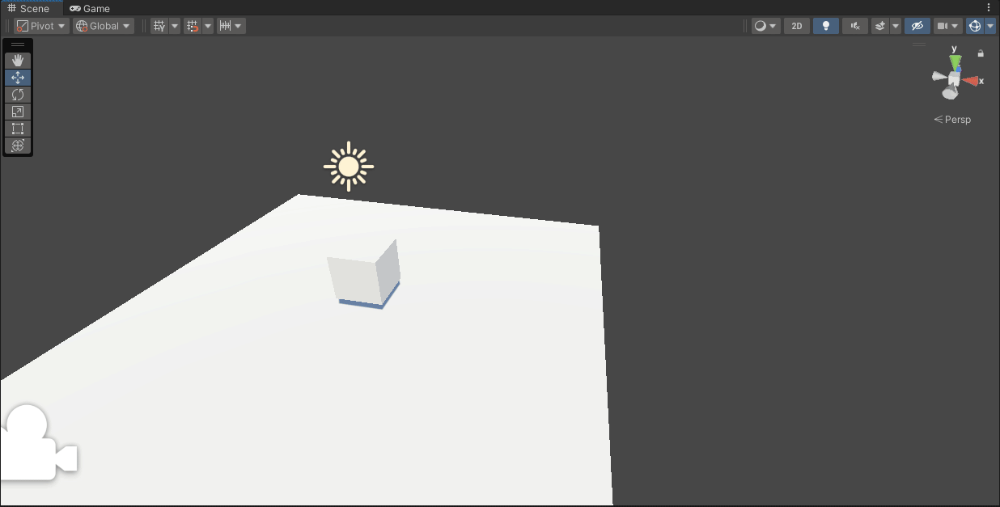

c. Poner al Objetivo una coordenada Y distinta de cero.

d. Modificar el script para que el objeto despegue del suelo y vuele como un avión.
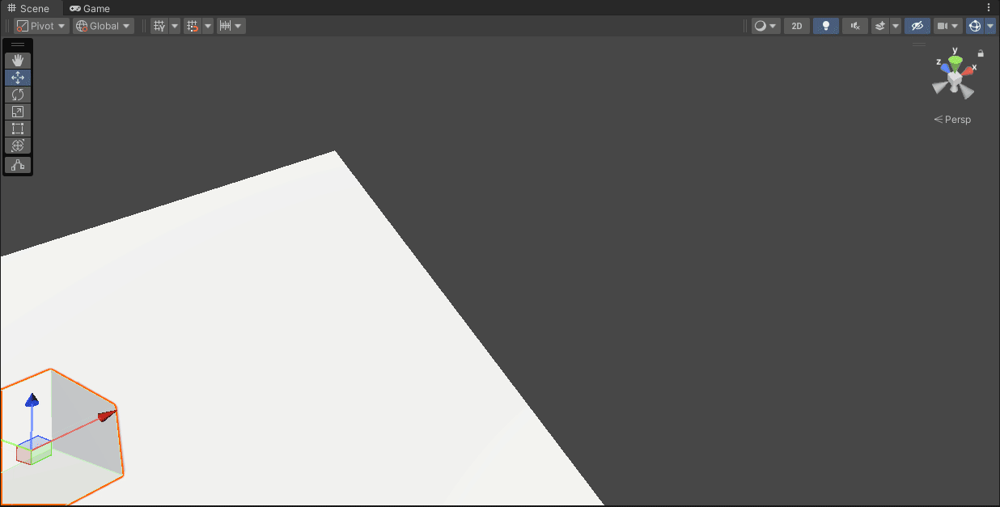
- Script: [Ejercicio1-d](scripts/Ejercicio1-d.cs)

e. Duplicar los valores de X, Y, Z del Objetivo. ¿Es consistente el movimiento? 
- No es consistente el movimiento, ya que `goal` se interpreta como una dirección y su magnitud interviene en la velocidad del movimiento
---
2. El Objetivo no es un objetivo propiamente dicho, sino una dirección en la que queremos movernos. La información relevante de un vector es la dirección. Los vectores normalizados, conservan la misma dirección pero su escala no afecta al movimiento. Se debe conseguir un movimiento consistente de forma que la escala no afecte a la traslación. Del mismo modo, se debe conseguir que el recorrido realizado por el personaje entre un frame y otro no tenga aberraciones espacio-temporales. Para ello se debe considerar la relación entre la velocidad, el espacio y el tiempo. Por otra parte, el tiempo que transcurre entre un frame y otro se obtiene con: `Time.deltaTime`
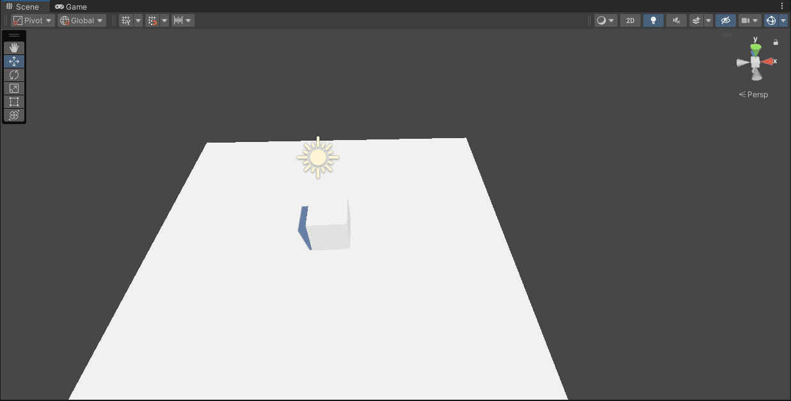

- Script: [Ejercicio2](scripts/Ejercicio2.cs)
---

3.  En lugar de seguir usando una dirección como objetivo, vamos a movernos ahora hacia una verdadera posición objetivo. Lo agregarermos como un campo público en la clase para poder configurarlo desde le Inspector. También agregaremos un campo para configurar la velocidad del personaje desde el propio Inspector. Aunque queramos desplazarnos hacia un punto en el espacio, el método Translate debe recibir la dirección del movimiento. La dirección que une dos puntos se obtiene restando el más lejano al más cercano. Por último, si el personaje no está encarando el objetivo (podría incluso estar de espaldas a él), el desplazamiento será suave pero la orientación de su malla no será consistente. Por esta razón será necesario rotarlo de forma que su eje z local (forward) apunte hacia el objetivo. La funciónLookAt del Transform nos ayudará con esto. En este caso, por tanto, para movernos hacia un punto en el espacio que configuramos a una velocidad dada:

4. Añadir Debug.DrawRay(this.transform.position,direction,Color.red) para depuración para comprobar que la dirección está correctamente calculada.

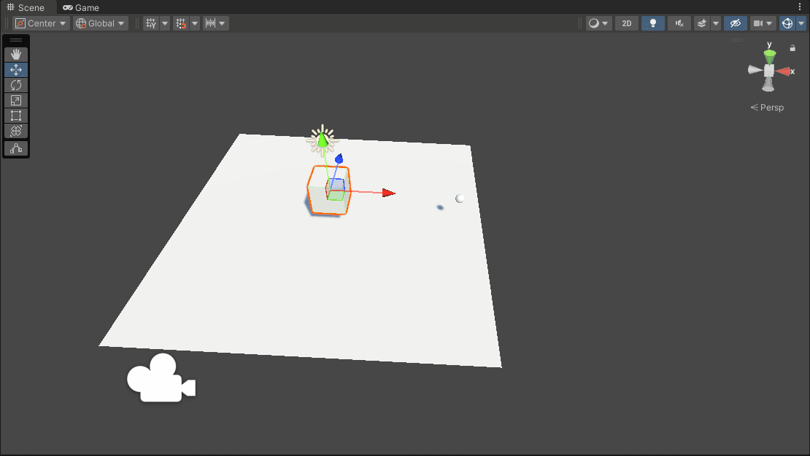
- Script: [Ejercicio3](scripts/Ejercicio3.cs)

---

5. Agregar un cubo en la escena que hará de objetivo, que debe ser movido usando el controlador de los Starter Assets. Sobre la escena que has trabajado ubica un personaje que va a seguir al cubo.

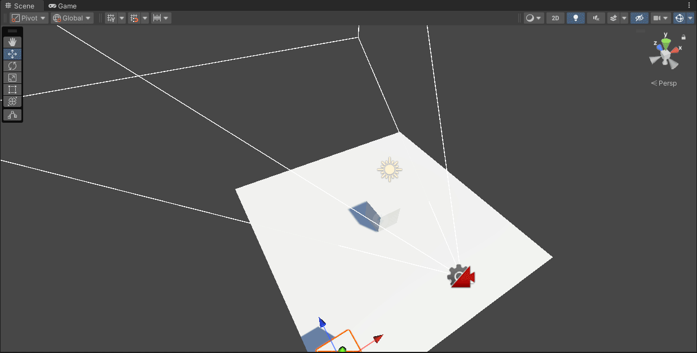

- Script: [Ejercicio5](scripts/Ejercicio5.cs)
---

6. 

a. Realizar un script que gire al personaje hacia su objetivo para llegar hasta él desplazándose sobre su vector forward local.
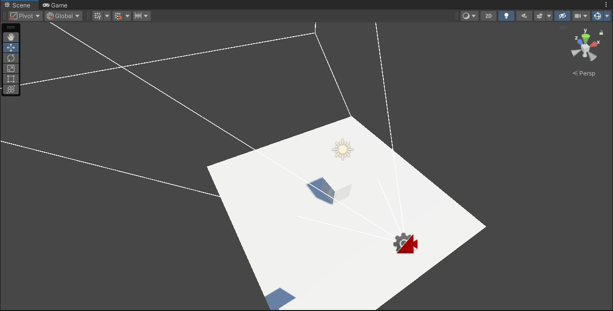

- Script: [Ejercicio6-a](scripts/Ejercicio6-c.cs)

b. Realizar un script que gire al personaje y lo desplace hacia su objetivo sobre la dirección que lo une con su objetivo. Normarlizar la dirección para evitar la influencia de la magnitud del vector
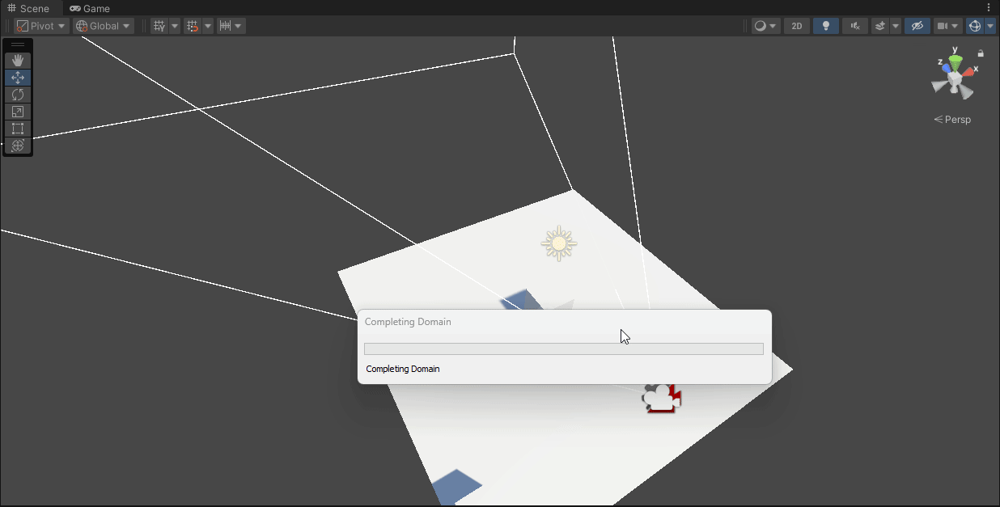

- Script: [Ejercicio6-b](scripts/Ejercicio6-b.cs)

c. Realizarun script que gire al personaje y lo desplace hacia su objetivo en la dirección que lo une con él, respecto al sistema de referencia mundial.
Normarlizar la dirección para evitar la influencia de la magnitud del vector.
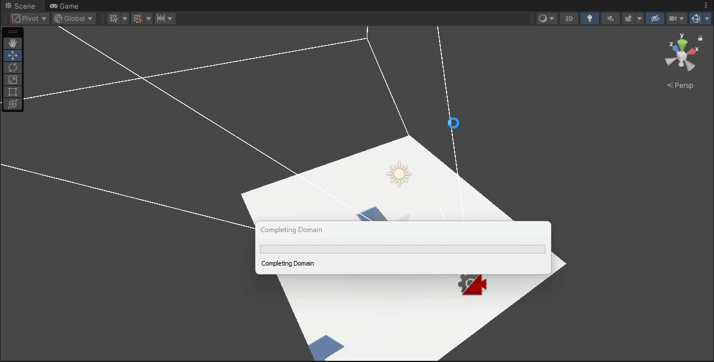

- Script: [Ejercicio6-c](scripts/Ejercicio6-c.cs)

---

7. Cuando ejecutamos el script, el personaje calcula la dirección hacia el objetivo y se mueve hacia él, pero no puede dejar de moverse y se produce jittering. La razón es que todavía estamos dentro del bucle, calculando la dirección y moviéndonos hacia él. En la mayoría de los casos no vamos a conseguir que nuestro personaje se mueva a la posición exacta del objetivo, con lo que continuamente oscila en torno a esa posición. Por eso, debemos tener algún cálculo del tipo de rango de tolerancia. Incluimos una variable global pública, public float accuracy = 0.01f; y una condición if(direction.magnitude > accuracy). Aún con el accuracy, el personaje puede hacer jitter si la velocidad es muy alta.

- Script: [Ejercicio7](scripts/Ejercicio7.cs)
---
8. En esta sesión se trabaja el Movimiento rectilíneo haciendo avanzar al personaje siempre en línea recta hacia adelante introduciendo una mejora. El uso de la función LookAt hace que el personaje gire instantáneamente hacia el objetivo, provocando cambios bruscos. Se aconseja realizar una transición suave a lo largo de diferentes frames. Para ello, en lugar de computar una rotación del ángulo necesario, se realizan sucesivas rotaciones donde el ángulo en cada frame viene dado por los valores intermedios al interpolar la dirección original y la final. Para esto utilizaremos la función Slerp de la clase Quaternion:

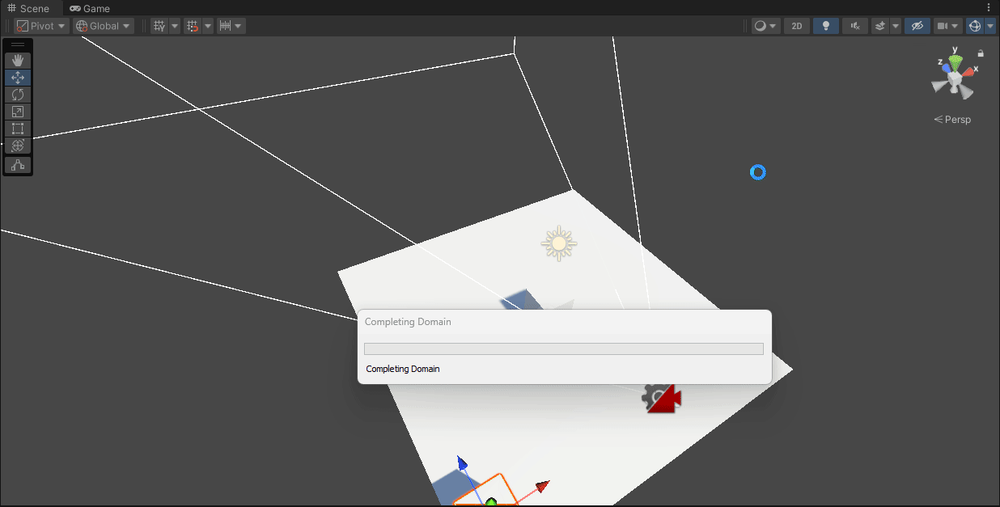

- Script: [Ejercicio8](scripts/Ejercicio8.cs)

--- 
9. 
10. 

Utilizar el sistema de waypoints

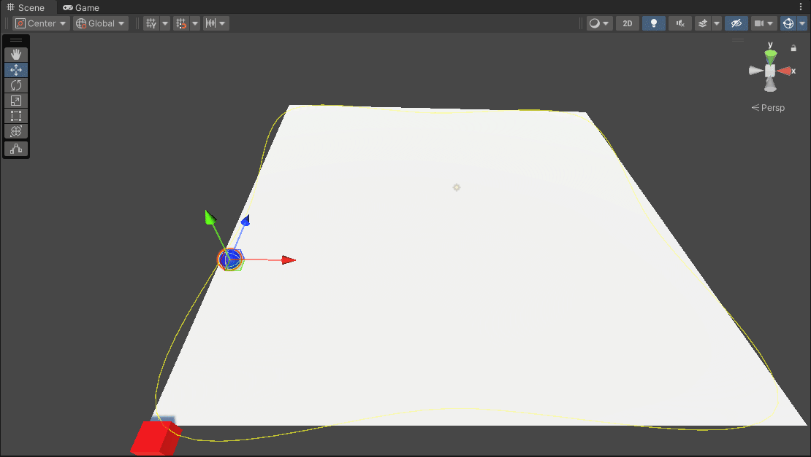

